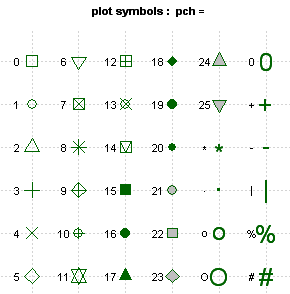

---
header-includes:
- \usepackage[utf8]{inputenc}
- \usepackage{graphicx}
- \usepackage[labelfont=bf]{caption}
- \usepackage{float}
- \usepackage{fancyhdr}
- \usepackage{fancyheadings}
- \pagestyle{fancy}
- \lhead{{\scriptsize Gráficos con R \\ \textit{\scriptsize www.gritos.org}}}
- \chead{}
- \rhead{\includegraphics[height=0.1\textwidth]{logo1.jpg}}
- \lfoot{\scriptsize - Manual de R - }{\scriptsize}
- \cfoot{}
- \rfoot{\thepage}
lang: es
output:
  pdf_document:
    fig_caption: yes
    fig_crop: no
    highlight: tango
    keep_tex: yes
    number_sections: yes
  html_document:
    fig_caption: yes
    toc: yes
    toc_depth: 2
---

<!-- pag sin encabezado para portada  -->
\begin{titlepage}
    \begin{center}
        \begin{LARGE}
            \textsc{MANUAL DE R \\
            }
            \textsc{
            APLICADO A LA CIENCIA DE DATOS \\ }
            \textsc{ --- \\
            CAPITULO 4 GRÁFICAS CON R }
        \end{LARGE}
        \textsc{ \\}
        \textsc{ \\}
        \includegraphics[width=0.8\linewidth]{portada.png}
    \end{center}
    \begin{large}
        \textit{ Manual de R en Castellano}
    \end{large}
    \begin{flushright}
        \textit{Fernando Villalba Bergado \\
        fervilber@gmail.com \\
        enero 2017 \\
        }
    \end{flushright}
\end{titlepage}

<!-- pag sin encabezado para TOC -->
\begin{titlepage}
    \tableofcontents
\end{titlepage}

<!-- pag sin encabezado para TOC de figuras -->
\begin{titlepage}
    \begin{scriptsize} 
        \listoffigures
    \end{scriptsize} 
\end{titlepage}

\pagebreak

```{r setup,include=FALSE}
#fig.pos="htbp"
knitr::opts_chunk$set(eval=FALSE,
                 echo=TRUE,
                 warning = FALSE,
                 error = FALSE,
                 message = FALSE,cache=FALSE,
                 fig.align='center',
                 fig.pos="H"
                )
  a4ancho<- 8.3
  a4alto<- 11.7
```

# INTRODUCCIÓN A LOS GRÁFICOS CON R <a name="l1"></a>

Lección del curso cuarto de la especialización en DATA SCIENCE.
Los apuntes corresponden a la semana 1 del curso Exploratory Data Analysis, donde se explica el uso de gráficos en R.

Este curso se centra en el [analisis exploratorio de datos](<https://es.wikipedia.org/wiki/An%C3%A1lisis_exploratorio_de_datos).

El análisis exploratorio de datos definido por John W. Tukey (E.D.A.: Exploratory data analysis) es, básicamente, el tratamiento estadístico al que se someten las muestras recogidas durante un proceso de investigación en cualquier campo científico. Para mayor rapidez y precisión, todo el proceso suele realizarse por medios informáticos, con aplicaciones específicas para el tratamiento estadístico. Los E.D.A., no necesariamente, se llevan a cabo con una base de datos al uso, ni con una hoja de cálculo convencional; no obstante el programa R es una de las aplicaciones más utilizadas.

Cuando estamos tratando con datos, lo primero que hacemos para comprenderlos y empezar a familiarizarnos con su estructura es crear gráficas de exploración, sencillas, burdas, incluso sucias, que nos permiten ver rápidamente aspectos generales y patrones de los datos que tratamos de investigrar.

Quizás necesitamos hacer cientos de estos gráficos exploratorios incialmete hasta que empezamos a comprender y ver la estructura de los datos que nos permita comprender el problema de estudio.

## Principios del análisis gráfico 

Existen unos  **Principios del análisis gráfico** sobre los que conbiene reflexionar y recordar en todo el proceso de trazado. Estos son los principios aplicados a la ciencia de datos: 

1. Siempre compara, busca una estado relativo sobre el que comparar los datos e hipótesis.
2. Muestra la causalidad, el mecanismo, la explicación del sistema y su estructura.
3. El mundo real es multivariable, no muestres solo una cara.
4. Presenta datos de forma integrada, es decir con diferentes puntos de vista o representación.
5. Documenta el proceso de analisis para que sea totalmente reproducible.
6. **Cuenta una historia, busca el contenido o fin de lo que presentas**.

Al representar los datos en gráficas buscamos muchas cosas: comprenderlos, encontrar patrones, sugerir modelos de comprotamiento. Hay un refrán español que dice que: *más vale una imagen que 1000 palabras*, por eso pintamos los datos.

Aunque existen muchas maneras de graficar datos con R, en estas lecciones vamos a centrarnos en tres sistemas que son los más habituales en R:
1. sistema R base.
2. librería lattice
3. librería **ggplot**.

Además del sistema de representación y sus fucniones debemos prestar atención a la salida física de los gráficos:

 * ¿Será en papel? o en una pantalla?
 * ¿Se usará en una web?, para una presentación?
 * ¿es muy grande el número de datos a pintar?
 * ¿Necesitaremos que cambie de tamaño de forma dinámica? o interactuar con él?
 * ¿qué sistema usaremos para pintar?.... oleo, pastel, digital?

El tipo de salida lo veremos en el apartado de [**dispositivos gráficos**](#dgraf) y puede ser importante si piensas usarlos no solo en la pantalla, sino para presentaciones o libros.

En las lecciones del curso web se usa una tabla de datos extraída de la web de la agencia EPA de EEUU. Desde su web [EPA Air Quality System](https://www.epa.gov/aqs) podemos descargar los datos de ejemplo, que se corresponden con datos de calidad del aire en EEUU.
```{r eval=TRUE, echo=FALSE}
    setwd("C:/R/proyectos/Data_Science_Coursera/04_EXPLORAR_Y_ANALIZAR_DATOS/")
```

```{r eval=TRUE}
# Lectura del fichero con los datos EPA  para los ejemplos
    pollution <- read.table("avgpm25.csv", header =TRUE,
        colClasses=c("numeric", "character","factor","numeric","numeric"))
    head(pollution, 3)
```
Para estos apuntes hemos usado además, tablas de datos ejemplo incluidas en la librería `datasets`, en concreto las tabla `cars`y `faithful`.


## Gráficos simples de 1 variable <a name="g1d"></a>

El análisis exploratorio partimos de una tabla de datos (obtenida por ejemplo de la lectura de un fichero). Esta tabla  contiene las observaciones en cada linea y las variables por columna. Se definen los gráficos simples de una variable como aquellos que nos pintanlos datos de una columna de la tabla.

La forma más sencilla de ver los datos de una variables es haciendo una gráfica rápida y sencilla de la misma. Representar los datos nos da mucha información del rango, número, amplitud, forma etc.. de dicha variable. Para ello usaremos alguna de las siguientes funciones del Sistema Base de R:

1. *summary(data)* que devuelve el min, max, media, mediana y 2 cuantiles, no pinta, pero siempre es bueno este resumen.
2. *boxplot(data, col="blue")* --> hace un gráfico simple con los datos de summary y una caja color azul -en este caso- que continene el 50% de los datos (entre el 25 y el 75%)
3. *hist(data, col ="green", breaks=10 )*, hace la gráfica del histograma de frecuencias en 10 partes. Se puede omitir breaks. Puedes añadir una marca de los datos con `rug(pollution$pm25)`
4. *barplot(data, col=wheat)* hace gráfico de barras color trigo(wheat).

Veamos unos ejemplos de código, en los que dibujamos un boxplot o gráfica de cajas que representa de forma sencilla una variable y un histograma de frecuencias de la misma:
```{r eval=TRUE, fig.cap='gráficas de una variable',fig.width=0.8*a4ancho,fig.height=0.25*a4alto}
    library(datasets) # cargamos el paquete de datos de muestra
    head(cars,4);dim(cars) # vemos los primeros 4 elementos y las dimensiones de la tabla
# Resumen de una de las variables o col de la tabla
    summary(cars$speed) # da el min, 25%,mediana=50%, media, 75%, max
    quantile(cars$speed) # los cuantiles
    names(cars) # nos devuelve los nombres de las variables en la tabla cars
# 1ª GRAFICA EXPLORATORIA: BOXPLOT 
    par(mfrow=c(1,2),mar=c(1,3,3,1))#mar=c(bottom, left, top, right)
    boxplot(cars$speed, col="lightgrey",main="Gráfico de caja de una variable")
# Si queremos añadir una linea al boxplot, por ejemplo para marcar el limite de 12
    abline(h=10, lty=3, lwd=2)
# 2ª GRAFICA EXPLO. HISTOGRAMA DE UNA VARIABLE  
    par(mar=c(5,5,3,1))#mar=c(bottom, left, top, right)
    hist(cars$speed, col="wheat")
    # La funcion rug() pinta una marca bajo cada punto de datos 
    # graficas de histograma 1 dimension
    rug(cars$speed)
```
\clearpage 

## Gráficos más complejos <a name="g2d"></a>

Si queremos ver mas de una variable, podemos repetir el proceso de pintado anterior para cada una de las variables o columnas de nuestros datos, por ejemplo pintamos dos histogramas en el mismo gráfico usando el atributo `add=TRUE`.

Vamos a hacer un ejemplo en el que generamos 2 series aleatorias de 500 observaciones y medias 4 y 6. Usamos en los colores el atributo `alpha=0.5` para generar transparencia.

```{r eval=TRUE, fig.cap="Dos histogramas juntos",fig.width=0.9*a4ancho,fig.height=0.33*a4alto}
    set.seed(42) # iniciamos semilla aleatoria
    # Pintamos la 1 grafica
    hist(rnorm(500,4),xlim=c(0,10),col='skyblue',border=F, 
         main="Dos histogramas juntos", xlab="x" , ylab="frecuencia")
    # Pintamos segunda grafica encima
    hist(rnorm(500,6),add=T,col=scales::alpha('red',.5),border=F, xlab="x") 
```

Tambien podemos usar las funciones `boxplot` o `with`para pintar varias variables.
Por ejemplo cuando comparamos dos variables x ~ y es muy útil la función `with(dataframe, plot(x,y,...))`
donde la `x` e `y` se sustituyen por nombres de columnas en la dataframe.
Una fórmula parecida usa la función `boxplot(x~y,data=dataframe, ...)`.
```{r eval=TRUE, fig.cap="uso de la funcion with", fig.width = 0.8*a4ancho, fig.height = 0.3*a4alto}
# Grafica X~Y usando los datos de la df cars
    with(cars, plot(speed,dist,col=rgb(0,.5,.5,0.3),pch=19, cex=2)) # cex= tamaño 2x puntos
```
Usando una de las variables como factor podemos sacar un gráfico muy completo usando graficas simples:
```{r eval=TRUE, fig.cap="uso boxplot para sacar graficas complejas", fig.width = 0.8*a4ancho, fig.height = 0.3*a4alto}
# Tambien boxplot vale para pintar varias series usando una variable como factor de color
    micolor <- rainbow(7, v=0.5,alpha=0.5)
    boxplot(dist ~ speed ,data=cars, col=micolor, xlab="distancia",
        ylab="velocidad", main= "comparar distancia vs velocidad")
```

## Gráficos múltiples

Llamamos gráficos multiples cuando dividimos el espacio de trabajo o lienzo en varios rectangulos y pintamos una gráfica en cada zona. Esta característica se controla con la función `par()`que ampliaremos más adelante, pero resaltamos ahora el atributo `mfrow=c(num_filas,num,col)` que es muy útil para crear multigraficas.

Veamos un ejemplo simple:

```{r eval=TRUE,fig.cap="Multigraficas",fig.width=0.9*a4ancho,fig.height=0.4*a4alto}
# USO DE par() en mMULTIGRAFICAS 
# Dividir la ventana grafica en 2 filas y 2 col (4 graficas)
    par(mfrow=c(2,2), mar=c(4,4,2,1)) # 2 filas x 2 col, mar=c(bottom, left, top, right)
    hist(subset(pollution, region=="east")$pm25, col="lightgreen", main="Hist_1")
    hist(subset(pollution, region=="west")$pm25, col="lightblue", main="Hist_2")
    
    with(pollution, plot(pm25,pollution$longitude,col=rgb(0,.2,.2,0.3),pch=19, cex=1)) 
    boxplot(pollution$pm25,col="lightgrey",horizontal=TRUE)
    dev.off() #salimos del entorno multigrafico
    
```

## Gráficos de dispersión (SCATTERPLOT)  <a name="sc"></a>
Otros gráficos habituales son los llamados de dispersión o scatterplot en inglés.

Para hacerlos en R usamos dos funciones `plot` y `with`

1. `plot(y ~ x, data = unatabla)` o `plot(x,y, col=x1)`  
    el símbolo ~ se hace con la tecla AltGr + 4.
2. `with(unatabla, plot(y, x))`

Se trata de funciones poderosas, pues nos dan acceso simple a opciones de agrupamiento automático. 

Si seleccionamos un factor como variable en alguno de los atributos de color del gráfico `(col= variable_factor)`, el resultado del mismo es una gráfica compleja que agrupa los datos según dicha variable seleccionada. El resultado es el equivalente a hacer split a los datos y pintar cada subgrupo, pero de forma muy sencilla.

Veamos un ejemplo . 
```{r eval=TRUE,fig.cap="Uso de agrupamiento de datos en el gráfico",fig.width=0.8*a4ancho,fig.height=0.3*a4alto}
# creamos una multigrafica de 1fila x 2col 
    par(mfrow=c(1,2))
# pintamos los datos x~y 
    with(pollution,plot(latitude,pm25,col="grey", pch=20))
    abline(h=12,lwd=2,lty=2)
# Ahora hacemos lo mismo pero ahora distinguiendo por colores según la variable "region".
    with(pollution,plot(latitude,pm25, col=region, pch=20))
    abline(h=12,lwd=2,lty=2)
```

Otra posibilidad es hacer graficas de dispersión (x~y) de subgrupos de datos. Puede escribirse el código que defina el subgrupo *(subset(df,condiciones)* directamente en la linea de llamanda al comando *plot* como veremos en este ejemplo:

```{r eval=TRUE,fig.cap="Hacer subgrupos de los datos con subset en la llamada a plot",            fig.width=0.8*a4ancho,fig.height=0.4*a4alto}
## multiples scatterplots
    par(mfrow=c(2,1), mar=c(2,4,2,1)) 
        with(subset(pollution, region=="west"),plot(latitude,pm25, main="WEST"))
        with(subset(pollution, region=="east"),plot(latitude,pm25, main="EAST"))
```

\clearpage 

## Uso de colores
Hay muchas maneras de especificar el color de los distintos elementos de una gráfica.
Por ejemplo, un vector así: `col=c(1:3)`, nos da los 3 colores primarios.

Existen 657 colores predefinidos en R, con nombre propio. Estos colores se almacenan en el vector `colors`. Si queremos generar una paleta de 10 colores podemos usar el comando `sample(colors(),10)` que nos da los nombres de 10 colores aleatorios de `colors`. Estos colores se pueden especificar directamente por su nombre como *"red"*, *"chocolate1"* o *"coral"*.

También existen paletas predefinidas en algunas librerias como grDevices o colorRamps con nombre especifico.
Podemos acceder a las mismas por su nombre (por jemplo en `grDevices` (*cm.colors,topo.colors, terrain.colors, heat.colors,rainbow*) y en `colorRamps` (*blue2red, matlab.like, matlab.like2, magenta2green*).

Si queremos personalizar los colores, R nos permite crear una paleta a gusto del usuario con los comandos `colorRamp` y `colorRampPalette` :

### Crear paleta de colores personalizada
`colorRamp` es una función que genera un color RGB a partir de colores discretos.
El valor del color se toma de forma continua entre 0 y 1 y devuelve un color RGB.

Veamos un ejemplo: Antes también definimos una función que nos será útil para representar los colores de una paleta continua:
```{r eval=TRUE, echo=TRUE, fig.cap='Uso de colorRamp',fig.width=0.5*a4ancho,fig.height=0.25*a4alto}
# Funcion para ver las escalas de color:
# esta funcion pinta una grafica con los colores de la escala.
verEscalas<-function(cv){
  myarg <- deparse(substitute(cv))
  z<- outer( 1:20,1:20, "+")
  obj<- list( x=1:20,y=1:20,z=z )
  image(obj, col=cv, main=myarg  )
}

# crea una paleta personalizada con colorRamp a partir del rojo y azul
    pal<-colorRamp(c("red","blue"))
# Usa la paleta anterior
    pal(seq(0,1,len=12))# crea 12 colores con la paleta hecha antes
    verEscalas(pal(seq(0,1,len=12)))
```
`colorRamPalette` es una función que devuelve un color hexadecimal a partir de colores discretos.
A diferencia de `colorRamp` que siempre da un único valor de color a partir de un argumento que siempre es un valor entre 0 y 1, `colorRamPalette`necesita de argumento el número de colores que queremos generar en la paleta.
Es algo más intuitiva, pues definimos los colores base, y después al llamarla generamos una paleta de x colores directamente.

Una de las ventajas de usar paletas personlizadas es que podemos definir también la transparencia de los colores mediante el argumento alpha, como veremos en el segundo ejemplo:

```{r eval=TRUE, echo=TRUE, fig.cap='Uso de colorRampPalette',fig.width=0.5*a4ancho,fig.height=0.25*a4alto}
# Paleta usando colorRamPalette
# Generamos una paleta personalizada aleatoria a partir de 3 colores
    coloresorigen<-sample(colors(),3)
# Podiamos usar una paleta predefinida
    #coloresorigen<-heat.colors(3) ;
    paletaFer<-colorRampPalette(coloresorigen,alpha=0.3)
    # vemos la paleta
    verEscalas(paletaFer(10))
    
# TRANSPARENCIA DE LA PALETA CON alpha
    pal3<-colorRampPalette(c("blue","green", "yellow"),alpha=0.5)
    verEscalas(pal3(20))
```

### RGB
La función rgb() es la base para la formación de colores, su uso es muy simple:

 `rgb(red, green, blue, alpha, names = NULL, maxColorValue = 1)`

### RColorBrewer paletas predefinidas
Como vimos la función `colors()` almacena colores básicos con nombre propio, y `colorBrewer` almacena paletas predefinidas, pero ojo se trata de un **paquete** opcional, que hay que instalar.
Una vez instalado se hace una llamada a `brewer.pal(num_colores,"nombre_paleta"), depues usamos `colorRampPalette` tal y como lo vimos en apartados anteriores:

```{r eval=TRUE, echo=TRUE, fig.cap='Uso de RColorBrewer',fig.width=0.5*a4ancho,fig.height=0.25*a4alto}
library("RColorBrewer") # cargamos librería
# Genera una paleta de 3 colores basados en la paleta  "BuGn"
    cols<-brewer.pal(3,"BuGn")
    # generamos paleta con estos colores
    pal<-colorRampPalette(cols)
    pal(20) # generamos 20 colores basados en la paleta

    # verEscalas(pal(20))
    # Vemos el uso de esta paleta con los datos de volcano
    # que contienen altura de un volcal de ejemplo package datasets
    image(volcano, col=pal(20))
```

\clearpage

# DISPOSITIVOS GRÁFICOS <a name="dgraf"></a>

## ¿Qué es un dispositivo gráfico?

Un dispositivo gráfico es el objeto en el que pintamos, el `lienzo` sobre el que trazamos las gráficas, por ejemplo:
    * una ventana en el PC, es un dispositivo gráfico de pantalla (screen device)
    * un fichero PDF 
    * un fichero PNG, JPEG 
    * un fichero SVG (scalable vector graphic)
    
Cuando generamos un gráfico en R, tiene que ser enviado a un dispositivo que haga de lienzo.
Para abrir un dispositivo usamos los comandos: `quatz()` en Mac, `X11()` en Linux, `windows()` en Windows.
Para ver qué dispositivos gráficos hay en nuestro sistema escribimos `?Devices` en la linea de comandos.

* `plot`, `xyplot`, `qplot` son funciones que envían por defecto el grafico al dispositivo "pantalla". Aunque podemos especificar otra salida diferente como por ejemplo un fichero que nos permita almacenar la imagen de nuestro gráfico de forma independiente.


## Cómo se crea un gráfico

Llamando explícitamente al dispositivo se crea.
Una vez aierto se convierte en el dispositivo activo y sobreescribe en él todas las llamadas a pintar.
Para cerrar especificamente un dispositivo llamamos a la función `dev.off()`
```{r eval=FALSE}
# Llamamos y creamos un fichero pdf como dispositivo gráfico.
pdf(file = "myplot.pdf")
    plot(x,y) # pintamos en el 
dev.off()     # salimos del dispositivo

# otro ejemplo con png
# plot to png 
png('plot6.png',height = 500, width=600, units = "px")
    plot(x,y)
dev.off()
```

## Salida en fichero
Podemos seleccionar muchos tipos de dispositivos de salida de fichero, cada uno con sus ventajas e inconvenientes.
A grandes rasgos, existen los ficheros vectoriales y los raster.

1. Vectoriales (pdf, svg, windows metafile o postscript)
    * Pros: bueno para graficos lineales, cambiar tamaño sin perder calidad sin distorsión.
    * Contras: no son buenos cuando hay gran cantidad de puntos/datos que pintar.
2. Raster (png, jpeg, tiff o bmp.)
    * Pros: bueno para salidas con muchos puntos
    * Contras: no se amplian bien, pierden calidad.

## Múltiples dispositivos gráficos

Podemos abrir muchos dispositivos, pero solo podemos pintar desde R en uno cada vez. Cada dispositivo tiene un número entero como identificador.

* `dev.cur()` --> nos da el numero del dispositivo actual, siempre mayor o igual a 2
* `dev.set(integer)`--> establece el dispositivo indicado en `integer` como actual.

## Copiar gráficas entre dispositivos
Se pueden copiar los graficos desde un dispositivo a otro diferente, por ejemplo cuando queremos grabar el gráfico en pantalla en un fichero:

```{r eval=TRUE,echo=FALSE, fig.cap="pintar en un fichero png",fig.width=0.8*a4ancho,fig.height=0.4*a4alto}
    # pintar en un fichero png
    library(datasets)
    with(faithful,plot(eruptions,waiting,pch=10)) # Crea un dibujo
    title(main="Erupciones del geyser") # sobre escribimos el título
```
```{r}
    library(datasets)
    with(faithful,plot(eruptions,waiting,pch=10)) # Crea un dibujo
    title(main="Erupciones del geyser") # sobre escribimos el título
    
    dev.cur() # nos muestra cual es el grafic device por defecto ahora
    dev.copy(png, file = "myfile.png") # copia el dibujo a un fichero png
    dev.off() # cierra el dispositivo png.
```

Para copiar en un fichero pdf existe una funcion especifica `dev.copy2pdf`
Ojo, pues los gráficos en fichero no tienen por qué mostrarse igual que en pantalla.

\clearpage 

# PRINCIPALES SISTEMAS DE TRAZADO GRÁFICO EN R
Existen muchas maneras de crear una representación gráfica con **R**, miles de funciones se han programado para pintar datos y hay decenas de librerías gráficas en <https://cran.r-project.org/>, pero hay tres que han destacado por su sencillez, amplias opciones y uso generalizado.

Estas tres librerías son:

1. **base plot system** o sistema base 
    Es el sistema de trazado por defecto incluído en el núcleo de R. La idea básica es la misma que se tiene al pintar un lienzo de artista sobre el que se van añadiendo cosas una a una, creando capas de pintura o efectos. Existen muchas funciones diferenciadas y epecificas para cada labor: lineas, etiquetas, puntos, gráficas...
    Es una manera muy completa de crear, pero tiene el inconveniente de que, si no quieres los valores por defecto tendrás que saber cómo hacer cada cosa específica.
2. **Lattice plot system**
    Los gráficos se crean de una vez. es bueno para muchas gráficas juntas en una página o pantalla.
3. **ggplot system**
    Es una mezcla de los anteriores con unas opciones por defecto interesantes y capacidad para personalizar todo.


## Base Plotting system (sistema base) <a name="BS"></a>

Es el sistema elemental para pintar gráficos con R.
Los comandos básicos son: `plot, hist, boxplot, barplot`= (pintar_genérico, histograma, grafico de cajas, grafico de barras).

Cada llamada a estas funciones lanza un objeto gráfico si no hay ya uno abierto.
Existen muchas opciones de personalización, cada una con una función que añade una nueva capa al dibujo, pero es interesante saber que gran parte de la personalización del lienzo se consigue a través de la función `par()`.

El sistema base está incluido en las librerías del núcleo de R `graphics` y `grDevices`. La primera contiene los comandos `plot`, `hist` etc. y la segunda todos los comandos relacionados con los dispositivos gráficos de impresión, ya sea la pantalla, un fichero o un pdf.

Una de las **desventajas** del _sistema base_ es que no se puede "ir hacia atrás"" una vez lanzado un comando.

### Parámetros globales de 'plot' (par):
Se usa `par()` para especificar estos parámetros globales, también para ver el valor de estos parámetros actualmente `par("col")`. entre los muchos atributos que se especifican con `par` están:

* `pch`: símbolo del dato (círculos por defecto. ver `points` para más detalles)
* `lty`: tipo de linea
* `lwd`: ancho de linea
* `col`: color, puede ser un número, o el nombre, hex o una función: `colors(4)`
* `xlab`: etiqueta eje x 
* `ylab`: etiqueta eje y
* `las`: orientación de las etiquetas del eje
* `bg`: background, color de fondo
* `mar`: margenes. (abajo, izq, dech, arriba).
* `oma`: tamaño de fuera de margen
* `mfrow`: divide el lienzo por el número de filas y columnas especificado. Se pinta por orden de filas.
* `mfcol`: divide el lienzo por el número de filas y columnas especificado. Se pinta por orden de Columnas.

Las opciones de personalización de par() son inmensas (72 para ser exactos), para ver todas podemos hacer la llamada siguiente:
```{r}
length(par())
names(par()) # esto nos da los nombres de las opciones

# para ver qué valores hay actualmente de cada atributo hacemos:
par()$pin #Plot dimensions in inches
par("pin") 
par("lty") #default line type is solid
```




### Funciones del Sistema Base 
El sistema base contiene muchas funciones de trazado, la principal y genérica es `plot(x,y,...)`, pero existen otras especificas para hacer lineas, puntos, segmentos, poner títulos...

* `plot`: crea un gráfico. Según los datos hace uno u otro tipo `plot(x,y,type="n"..)`
* `lines`: añade una linea a una gráfica.
* `points`: añade puntos a una gráfica.
* `segments`: pinta una linea entre dos puntos.
* `with`: crea un gráfico de dispersión. `with(tabla, plot(colA,ColB))`
* `text`: añade texto de etiquetas:`text(coorX,CoorY,"texto que se pone")`
* `title`: añade el título.
* `mtext`: añade texto en el margen.
* `axis`: añade las marcas y etiqueta de los ejes.
* `legend`: añade legenda.

### Plot
Plot es la función genérica a la que se pude llamar de diferentes maneras.
La típica llamada es:`ploy(x,y,type="b", main="titulo",xlab= "eje x", ylab="tit eje y")`

Con la función `plot` podemos especificar el tipo de gráfico a pintar con el argumento `type` que puede tomar los siguientes valores:

* "p" solo puntos,
* "l" lineas solas,
* "b" lineas y puntos,
* "c" solo lineas aparte,
* "o" para el tipo 'overplotted' similar al tipo "b"
* "h" para pintar un 'histograma',
* "s" pasos de escalera,
* "n" no pinta, pero ajusta la escala.

Es muy útil el tipo "n", pues al ser un sistema de capas,podemos ajustar los parámetros principales de escala en la linea de código inicial o primera capa, y después ir llamando funciones de grafiado especificas como lines, o points.

Para especificar los títulos se usan los argumentos:
* `main` --> para el titulo principal
* `sub`  subtitulo
* `xlab` descripción eje x
* `ylab` descripción eje y

```{r eval=TRUE, fig.cap="tipos de gráficas con plot",fig.width=0.8*a4ancho,fig.height=0.3*a4alto}
y<-rnorm(30)
par(mfrow=c(4,2),mar=c(3,3,2,2))
plot(y,type="p", main="tipo 'p'")
plot(y,type="l", main="tipo 'l'")
plot(y,type="b", main="tipo 'b'")
plot(y,type="h", main="tipo 'h'")
```

### Ejemplos con el Sistema Base 

Podemos usar la función `example` para ver muchos ejemplos gráficos directamente en R:
 * `example(points)` proporciona ejemplo de gráficas de puntos.

Vamos a ver unos ejemplo con la base de datos de airquality.
```{r eval=TRUE, fig.cap="Ejemplos con Base System",fig.width=0.7*a4ancho,fig.height=0.3*a4alto}
library(datasets)
# Usaremos en este ejemplo la data airquality que contiene medidas de ozono en NY en dias de 1973
# ver primeras lineas tabla de datos
    head(airquality,4)
# ver rango (min-max) de la variable ozono sin contar los NA
    range(airquality$Ozone,na.rm=TRUE)

# pinta un gráfico de histograma de la variable ozono de la tabla airquality
    hist(airquality$Ozone) 
#vams a ver cuantas medidas hay cada mes:
    table(airquality$Month)# comando table =summarize o aggregate
# hacemos un grafica de cajas para cada mes
    boxplot(Ozone~Month,airquality)
#hacemos lo mismo pero añadiendo etiquetas y colores
    boxplot(Ozone~Month,airquality, xlab="Month", ylab="Ozone (ppb)",col.axis="blue",col.lab="red")
#añadimos un titulo:
    title(main="Ozone and Wind in New York City")
# Ahora pintamos un scatterplot grafico de dispersión
    plot(airquality$Wind, type="n",airquality$Ozone) # type="n" dice que no pinte los datos en el grafico aún
    title(main="Wind and Ozone in NYC")
# creamos subconjunto de los valores de mayo
    may <- subset(airquality, Month==5)
#pintamos ese conjunto
    points(may$Wind,may$Ozone,col="blue",pch=17)
# ahora los meses que no son mayo
    notmay <- subset(airquality, Month!=5)
    points(notmay$Wind,notmay$Ozone,col="red",pch=8)

#añadimos la legenda
    legend("topright",pch=c(17,8),col=c("blue","red"),legend=c("May","Other Months"))
#añadimos una linea vertical:
    abline(v=median(airquality$Wind),lty=2, lwd=2)
```

Ahora ejemplos con varias gráficas usando `par()`.


```{r eval=TRUE,fig.cap="Ejemplos de multigraficos con Base System",fig.width=0.7*a4ancho,fig.height=0.3*a4alto}
    # dos graficos juntos
    par(mfrow=c(1,2))
    plot(airquality$Wind,airquality$Ozone,main="Ozone and Wind")
    plot(airquality$Ozone,airquality$Solar.R,main="Ozone and Solar Radiation")

    #ahora un grafico de 3 graficas
    par(mfrow = c(1, 3),mar = c(4, 4, 2, 1), oma = c(0, 0, 2, 0))
    plot(airquality$Wind,airquality$Ozone,main="Ozone and Wind")
    plot(airquality$Solar.R,airquality$Ozone,main="Ozone and Solar Radiation")
    plot(airquality$Temp,airquality$Ozone,main="Ozone and Temperature")
    mtext("Ozone and Weather in New York City",outer=TRUE)

# with(tabla, plot(col,colB))
    par(mfrow = c(1,2))
    with(airquality, plot(Wind,Ozone, main="Ozono y viento en NY",pch=20))
    # Añado que pinte los del mes de mayo en azul
    with(subset(airquality, Month==5), points(Wind,Ozone,col="blue"))
    # Añadimos una leyenda
    legend("topright", pch =1, col=c("blue","black"),legend=c("Mayo","otros"))
    #añadimos linea de regresion
    model<-lm(Ozone ~ Wind,airquality)
    abline(model,lwd=2)

# Grafica de cajas boxplot
    airquality<-transform(airquality,Month=factor(Month))
    boxplot(Ozone ~ Month, airquality, xlab="mes", ylab="ozono ppb")
```
Para las gráficas anteriores es interesante ver esta nueva manera de especificar las gráficas todas en la misma linea de comandos de `with( datatable, {.......})` todo lo que se encuentra entre las llaves se ejecuta. 

```{r}

#EJEMPLO GRAFICOS MULTIPLES
par(mfrow=c(1,2))# (filas, col)
with(airquality,{
    plot(Wind, Ozone, main="Ozono vs viento")
    model<-lm(Ozone ~ Wind,airquality) #
    abline(model,lwd=2) #
    plot(Solar.R, Ozone, main=" Ozono y radiacion solar")
})

```

\clearpage 

#### Ejemplo con escala temporal x
Cuando la variable x es una fecha, el gráfico ajusta la escala x como temporal automáticamente.
Vamos a ver un ejemplo de escala temporal y además multigráfica en el que usamos el atributo `type="n"` en la primera linea de plot, para definir la escala, pero no pintar la gráfica, y añadimos una a una el resto de gráficas al lienzo.

Además se guarda en fichero la imagen.
```{r}
# plot 4
png('plot4.png')
par(mfrow=c(2,2))

plot(data$DateTime, data$Global_active_power, ylab="Global Active Power (kilowatts)", xlab="", type="n")
    lines(data$DateTime, data$Global_active_power, type= "l")

plot(data$DateTime, data$Voltage, ylab="Voltage", xlab="datetime", type="n")
    lines(data$DateTime, data$Voltage, type= "l")

plot(data$DateTime, data$Sub_metering_1, ylab="Energy sub metering", xlab="", type="n")
    lines(data$DateTime, data$Sub_metering_1, type= "l", col="grey")
    lines(data$DateTime, data$Sub_metering_2, type= "l", col="red")
    lines(data$DateTime, data$Sub_metering_3, type= "l", col="blue")
    legend("topright",legend=c("sub-metering_1","sub-metering_2","sub-metering_3"),
       col=c("black","red","blue"),lty=c(1,1,1),lwd=2)

plot(data$DateTime, data$Global_reactive_power, ylab="Global_reactive_power", xlab="datetime", type="n")
    lines(data$DateTime, data$Global_reactive_power, type= "l")

dev.off()
```
 

\clearpage

## Lattice plotting system

### Introducción
Al igual que el sistema base, Lattice tiene unas funciones para el trazado. Es un sistema más conveniente para gráficos condicionales, de mucha densidad de puntos o varios gráficos a la vez. La ventaja es que los gráficos quedan más aparentes, mas bonitos ya que ajusta por defecto muchas cosas. La **desventaja** es que no se puede sobrescribir una vez pintado o es bastante complejo hacerlo. Tampoco es muy intuitivo en cambios de detalles del dibujo, es bueno haciendo lo que sabe por defecto.

Para usar los gráficos hay que cargar la librería `lattice`, pero también se carga como  dependencia la librería `grid` que es la base sobre la que pinta lattice.

Los gráficos de lattice son del tipo o clase de objeto `trellis`, cuyas funciones de dibujado principales son:

 * `xyplot` --> dispersión  (scatterplot)  
 * `bwplot` --> gráficos de caja (boxplots) 

**En Resumen** las diferencias fundamentales con el sistema base son:

 * El sistema base traza en un dispositivo gráfico (pantalla, png...).
 * Lattice no traza en un dispositivo, simplemente devuelve un objeto `trellis`.
 * Este objeto `trellis` es impreso por las funciones `print`de lattice.

### Funciones gráficas principales

* `xyplot`: para gráficos de dispersión (scatterplot)
* `bwplot`: boxplot, gráficos de caja
* `histogram`: histogramas
* `stripplot`: boxplot especial
* `dotplot`: gráfico de cuerdas de violín
* `splom`:matriz scatterplot ; como `paris` en base system
* `levelplot`, `contourplot`: para pintar datos de imagene.

### xyplot` function
La funcion principal se usa así: (recordar que el símbolo ~ se hace con la tecla AltGr + 4).

```{r}
xyplot(y ~ x | f * g, data)
```

* Usa una notación de fórmula.
* f,g son las llamadas variables de condición, que son opcionales.
    * Son variables de categoría (factores) que condicionan la salida gráfica
    * es decir, queremos ver x-y para cada condición de f o g
* data = el dataframe o tabla asociada cuyas columnas son x e y.

#### Ejemplos con lattice

Gráfica de 5 subgráficas en 2 lineas:
```{r eval=TRUE, fig.cap="ejemplo multigraficas con Lattice 1",fig.width=0.7*a4ancho,fig.height=0.3*a4alto}
library(lattice)
library(datasets)
# ojo que xyplot pinta ozone como eje y y wind en eje x es decir y~x
xyplot(Ozone ~ Wind, data = airquality)
# transformamos la variable mes en factor
airquality <- transform(airquality, Month = factor(Month))
xyplot(Ozone ~ Wind | Month, data = airquality, layout = c(5, 1))

#tambien se puede poner:
#xyplot(Ozone ~ Wind | as.factor(Month), data = airquality, layout=c(5,1)) 
```

Nuevo ejemplo:

```{r fig.cap="ejemplo multigraficas con Lattice 2",fig.width=0.9*a4ancho, fig.height=0.3*a4alto}
 library(lattice)
 library(datasets)
#usaremos la bd state
head(state)
# vamos a ver las categorias que hay en la veriable region
table(state$region)
# Usaremos lattice
# xyplot(variables, base de datos, plantilla=par)
xyplot(Life.Exp ~ Income | region, data = state, layout = c(4, 1))
#si cambiamos la plantillaa 2x2
xyplot(Life.Exp ~ Income | region, data = state, layout = c(2, 2))
```


### Lattice panel 
Lattice tiene un **_panel functions_**  que controla qué pasa dentro de cada panel, que en parte suple las anotaciones que se hacen en el sistema base para personalizar el gráfico.

Es muy interesante para añadir lineas, medias o modelos de regresión a los datos en lattice.
Veamos un ejemplo con datos generados aleatorios:

```{r eval=TRUE,fig.cap="Modelos en multigraficas con Lattice 3",fig.width=0.9*a4ancho,fig.height=0.3*a4alto}
 library(lattice)
# Generamos serie aleatoria
    x <- rnorm(100) # genera 100 numeros normales entre 0-1
    f <- rep(0:1,each=50) # repite 0 50 veces y 1 otras 50
    y<-x+f-f*x+rnorm(100,sd=0.5)
    
    f<-factor(f,labels=c("Grupo 1", "Grupo 2"))
# Pintamos la sereie
    xyplot(y~x | f, panel= function(x,y,...){
        panel.xyplot(x,y,...) # llamamos a pintar
        panel.abline(h=median(y),lty=2) # añadimos linea horizontal en la media
        panel.lmline(x,y,col=3)# añade una linea de regresion
    } )
```
### RESUMEN LATTICE

```{r}
set.seed(12)
y<-rnorm(100)
x<-1:100
#f<-rep(50,c(1,2))

xyplot(y~x,col="red", pch=8, main="Datos de muestra")
bdatos<-data.frame(x,y)
xyplot(y~x,data=bdatos, col="red", pch=8, main="Datos de muestra")

p2 <- xyplot(y ~ x | f, panel = function(x, y, ...) {
  panel.xyplot(x, y, ...)  ## First call default panel function
  panel.lmline(x, y, col = 2)  ## Overlay a simple linear regression line
  panel.abline(h = median(y), lty = 2)  ## Add a horizontal line at the median
})

xyplot(y~x|zcol*tfila,data=diamonds,strip=FALSE,pch=20,xlab="myxlab",ylab="myylab",main="mymain")
```

\clearpage

## ggplot2

[ggplot2](http://ggplot2.org) es una mezcla de lattice y base system. Lo más importante respecto a **lattice** es que permite sobrescribir encima de una gráfico de forma intuitiva y que usa una gramática gráfica que lo hace más sencillo.
Se ha convertido por méritos propios en el primer sistema gráfico de R por su uso.

**ggplot2** es la librería o paquete actualizado de ggplot, que fue la primera implementación de este código en R.

### ¿Qué es ggplot2?

* Un desarrollo de gramática gráfica(gg).(autor Hadley Wickham mientras estaba graduándose en Iowa)
* gramática gráfica es una representación abstracta de gráficos, ideas y objetos.
* Algo así como pensar en "verbos", "nombres" y "adjetivos" para gráficos
* Permite escribir nuevos gráficos y manejarlos como objetos
* pretende ser una forma natural de visualizar gráficos de la mente a la pantalla.

#### qué ventajas tiene sobre attice y base system
Que puede ir hacia atrás para modificar un gráfico, y que permite anotaciones una vez pintado. ggplot trata automáticamente muchos aspectos tediosos, como espacios, textos títulos pero al mismo tiempo permite, si queremos personalizarlos, también es más intuitivo que lattice para multigráficas.


### `qplot` comándo básico 
"quick plot"-->qplot
* es como plot en base system
* busca siempre en un dataframe, si no lo encuentra busca en el directorio padre.
* Los gráficos generados son automáticamente ajustados para aparentar estética y geometría bella.

**Factores etiquetados**

Es importante tener en cuenta el uso de factores para dibujar subconjuntos de datos.Los factores indican subconjuntos y debemos tenerlos en cuenta.

* `qplot` esconde debajo la función base: `ggplot`
* `ggplot` es el núcleo de ggplot2 y muy flexible

#### Ejemplo simple

```{r, eval=TRUE,fig.cap="Grafica simple con ggplot",fig.width=0.8*a4ancho,fig.height=0.33*a4alto}
# installation
if (!require("ggplot2")) install.packages("ggplot2")
library(ggplot2)
library(datasets)
#usaremos la data mpg que contiene datos de consumo de coches 
str(mpg)
head(mpg)

# grafico simple
#pintamos con qplot(varA, varB, data=BD)
qplot(displ, hwy, data = mpg)
```

#### Subconjuntos gráficos usando factores

Si añadimos una de las variables (*factores*) a la llamada de qplot (variable *drv*), vemos que automáticamente el gráfico nos distingue por colores los datos:

```{r}
qplot(displ, hwy, data = mpg, color = drv)
qplot(displ, hwy, data = mpg, color = drv, geom = c("point", "smooth")) 
```
Puede ser muy útil en la conversión a factores los siguientes comandos de R:
 * `cut(variable, breaks= num_particiones, labels=c("nombres_paracada_particion"))`
 
```{r eval=TRUE,fig.cap="Uso de factores ggplot",fig.width=0.8*a4ancho,fig.height=0.33*a4alto}
airquality <- transform(airquality, Month = factor(Month))
qplot(Wind, Ozone, data = airquality, facets = . ~ Month) 
```


#### Boxplot con qplot
Para hacer gráficos de caja con ggplot y qplot usamos el atributo `geom="boxplot"`. 
```{r eval=FALSE,fig.cap="Boxplot con qplot de ggplot",fig.width=0.8*a4ancho,fig.height=0.33*a4alto}
# boxplot
qplot(drv, hwy, data = mpg, geom="boxplot")
#qplot(drv, hwy, data = mpg, geom="boxplot", color=manufacturer)
```

#### Histogramas

Para hacer Histogramas debemos especificar una sola variable de la tabla origen, aunque podemos añadir otras variables como factores o subconjuntos para hacer los histogramas mucho más atractivos e informativos.

En este caso usaremos el argumento `fill` que especifica el color de relleno de las barras con una variable factor.

```{r eval=FALSE,fig.cap="Histogramas con qplot/ggplot",fig.width=0.8*a4ancho,fig.height=0.33*a4alto}
qplot(hwy, data = mpg, fill = drv)
```

#### Graficos de barras
Ver esta web con muchos ejemplos <http://docs.ggplot2.org/0.9.3.1/geom_bar.html>

```{r eval=TRUE,fig.cap="grafico de barras con qplot/ggplot",fig.width=0.8*a4ancho,fig.height=0.33*a4alto}
qplot(factor(cyl), data=mtcars, geom="bar", fill=factor(cyl)) + 
    theme(legend.position="top") +
    theme(legend.text = element_text(colour="blue", size=6)) +
    theme(legend.title = element_blank())

# Stacked bar charts
qplot(factor(cyl), data=mtcars, geom="bar", fill=factor(gear))
```

\clearpage 

#### Facets (multigraficas en ggplot)

Es como el comando *panels* en lattice o el comando `par()` del *base system*. 
Si queremos distinguir subconjuntos en diferentes gráficas, una opción que vimos antes es por colores en la misma gráfica y otra es separando cada subconjunto en gráficos independientes con `facets`.

`facets` se introduce como dos variables separadas por este símbolo `~`. a la izquierda indica las columnas y a la derecha las filas (variable usada para distinguir filas). Si no se especifica variable se debe poner `.` (un punto).

Veamos un ejemplo:
```{r eval=TRUE, fig.cap="Facets paneles con qplot/ggplot",fig.width=0.7*a4ancho,fig.height=0.33*a4alto}
# para cada valor de drv una grafica independiente (una columan nueva)
qplot(displ, hwy, data = mpg, facets = . ~ drv)
# para cada valor de drv una grafica en fila nueva
qplot(hwy, data = mpg, facets = drv ~ ., binwidth = 1)
```
#### Funciones estadísticas (modelo regresión)

ggplot tienen la posibilidad de añadir de manera simple modelos estadísticos y de regresión al gráfico.
Por ejemplo añadimos al modelo anterior, una linea de regresión suavizada:

```{r eval=TRUE,fig.cap="Añadir modelo de regesión ggplot",fig.width=0.8*a4ancho,fig.height=0.3*a4alto}
qplot(displ, hwy, data = mpg, geom = c("point", "smooth"))
```

#### Funciones estadísticas (densidad)

Con ggplot podemos sacar directamente la función de densidad de la variable de muestreo llamando al argumento `geom = "density`. Las función de densidad nos da la probabilidad de cada valor de muestreo en base al conjunto de valores. (el área bajo la curva suma 1).
Al igual que en el resto de funciones, al añadir una variable como color, nos pinta de forma diferenciada las agrupaciones para cada valor de la variable seleccionada como color.En el ejemplo veremos las gráficas de densidad para la tabla de diamantes según el tipo de corte.

```{r eval=TRUE,fig.cap="Función de densidad con ggplot",fig.width=0.8*a4ancho,fig.height=0.3*a4alto}
qplot(price,data=diamonds,geom="density") # nos da la funcion de densidad o probabilidad
qplot(price,data=diamonds,geom="density",color=cut)
```

\clearpage 

#### Gráficos de dispersión X-Y Scatterplot

Para separar subconjuntos por color o forma de los puntos usaremos como argumento `color` o `shape` con una variable factor.
Podemos además incluir lineas suavizadas en los datos con el argumento: `method`.

```{r eval=TRUE,fig.cap="Ejemplo de dispersion con ggplot",fig.width=0.8*a4ancho,fig.height=0.32*a4alto}
# subconjuntos por forma
head(pollution,5)
#usamos los datos de pollution
qplot(longitude, log(pm25), data = pollution, shape = region, color=region)

# Añadir liea de regresión suavizada
qplot(longitude, log(pm25), data = pollution, shape = region,
      facets = . ~ region,
      color=region, geom = c("point", "smooth"))
# otra forma: distinguiendo por color
qplot(longitude, log(pm25), data = pollution, shape = region) + 
    geom_smooth(method = "lm")
```

Como veremos más adelante, es posible incluir funciones de ggplot en qplot que es la versión simplificada.
Así por ejemplo para incluir un modelo de resgresión lineal podríamos hacerlo así:
```{r}
# con la data diamons
qplot(carat,price,data=diamonds, color=cut) 
    + geom_smooth(method="lm")
```

\clearpage 

#### Resumen de qplot
En resumen qplot, que es la función más simple de la librería ggplot2, es una forma simple de pintar gráficos que da resultados estéticamente buenos y muchas opciones de trazado.

La forma básica de llamar a qplot es:
`qplot(x,y,data=dataframe, geom="line", facets= . ~ varA)`

El tipo de gráfico lo definimos con `geom`que puede tomar un valor simple o un vector con varias opciones que se suman. Los tipos de geometría son: `"point", "smooth", "boxplot", "line", "histogram", "density", "bar", "jitter"`


```{r}
par(mfrow=c(1,2))
# grafico simple
qplot(displ,data = mpg)
# Añadir otra variable a la grafíca por colores
qplot(displ, data = mpg, fill = drv)
# X-Y grafica  
qplot(displ, hwy, data = mpg, color = drv)

#Facets o varias gráficas
qplot(hwy, data = mpg, facets = drv ~ ., binwidth = 2,fill = drv)
#binwidth=ancho de la banda o agrupacion 

# Histograma con factor 
qplot(hwy, data = mpg, fill = drv)
qplot(hwy, data = mpg, fill = drv, main="Titulo")

qplot(x,data=datos, fill=colFactor) 

qplot(x, data=datos, geom = "density", color = colFactor)
#  X-Y Scatterplot
qplot(x, y, data = datos, color = datos$colA) +
    geom_smooth(method = "lm")
# Añadir modelo de regresión a la gráfica
qplot(displ, hwy, data = mpg, geom = c("point", "smooth"))

# añadimos un panel
qplot(displ, hwy, data = mpg, geom=c("point","smooth"),facets = . ~ drv)

qplot(carat,price,data=diamonds, color=cut, facets = .~cut) + geom_smooth(method="lm") 
```


### ggplot
Cuando queremos personalizar aún más una gráfica con el paquete ggplot2 tenemos que dejar la función básica `qplot` por la completa o de más bajo nivel que es: `ggplot`

Usando esta función podemos personalizar todo. `ggplot`contiene 7 funciones básicas que son:

 1. dataframe `data`: el dataframe de origen de los datos
 2. funciones estéticas: color `aes`, tamaño
 3. geometría de los objetos `geoms`: puntos, lineas, barras, títulos
 4. facets `facet`: paneles multigraficas o condicionales.
 5. estadísticas `stats`: transformaciones estadísticas a los datos como colas, cuantiles, suavizado...
 6. escalas `scales`: personaliza `aes`
 7. Sistemas de coordenadas`coordinate_system`:

#### Construir gráficos con ggplot2

El sistema usado por ggplot2 es como el de un artista ante un lienzo, las gráficas se construyen con **capas**: la capa de datos, la de anotaciones encima etc.
El gráfico básico es `ggplot(dataframe, aes(variableX,variableY))`

Veamos un ejemplo sencillo con la base de datos de ejemplo **mpg** del paquete `datasets`: 

```{r eval=TRUE,fig.cap="uso de ggplot",fig.width=0.8*a4ancho,fig.height=0.32*a4alto}
#install.packages("ggplot2")
library(ggplot2)
library(datasets)
# llamamos a ggplot y almacenamos en una variable donde vamos añadiendo las capas
g <- ggplot(mpg, aes(displ,hwy)) + #aes(x,y)
    geom_point() + #añadimos un x-y =scatterplots
    geom_smooth(method="lm") # añadimos un linear model
    # + facet_grid(.~drv)
print(g)
# esto mismo con qplot sería equivalente a:
#qplot(displ, hwy, data = mpg, geom=c("point","smooth"),facets = . ~ drv)
```


#### Anotaciones y temas en ggplot
Para añadir anotaciones, títulos etc. al gráfico usaremos las funciones `xlab`, `ylab`, `lab` y `ggtitle`. Para cada función hay muchas opciones.

Resaltamos que existen temas o paletas ya almacenadas en ggplot como conjuntos de colores predefinidos, que nos sirven para cambiar de forma global el aspecto del gráfico con el comando  `theme()`, por ejemplo `theme_gray()` para que la gráfica use solo grises o `theme_bw()` para una salida en blanco y negro por ejemplo para su uso en libros o copias.

Cambien se puede definir un tema o personaliza:`theme(legend.position = "none")`
    
Veamos en acción estas características: 
    
    
```{r eval=TRUE,fig.cap="uso de ggplot con temas",fig.width=0.8*a4ancho,fig.height=0.32*a4alto}
# llamamos a ggplot almacenandolo en una variable y añadiendo las capas
g <- ggplot(mpg, aes(hwy,displ)) + #aes(x,y)
    geom_point(color="steelblue", size=2, alpha=1/2) + #añadimos un x-y =scatterplots
    geom_smooth(size = 2, linetype = 2, method = "lm", se = FALSE) +# añadimos un linear model
    theme_gray(base_family = "Times") +
    labs(title = "frenazos de coches") + # podia usarse ggtitle("frenazos de coches")
    labs(x = "m", y = "Desplazamiento") 
print(g)
``` 


```{r}
g <- ggplot(mpg, aes(hwy,displ)) + #aes(x,y)
    geom_point(color="steelblue", size=2, alpha=1/2) + #añadimos un x-y =scatterplots
    geom_smooth(size = 2, linetype = 2, method = "lm", se = FALSE) +# añadimos un linear model
    theme_gray(base_family = "Times") +
    labs(title = "Frenazos en coches") +
    labs(x = "m", y = "Desplazamiento") +
    geom_line() + #añade un grafico de lineas
    ylim(0, 6) +# limites del eje y min, max
    theme_minimal()
print(g)

# si queremos hacer la misma gráfica pero que tenga un colr diferente en cada valor de drv
# sustituimos geom_point por:
# geom_point(aes(color=drv), size=4,alpha=1/2)
# si los valores no son constantes debemos usar aes(), no valdría color=drv 
   
```


#### Gráfico de cajas
```{r eval=TRUE,fig.cap="Grafico de cajas con ggplot",fig.width=0.8*a4ancho,fig.height=0.32*a4alto}
ggplot(diamonds,aes(carat,price))+
    geom_boxplot()+
    facet_grid(.~cut)
```

#### Limitar ejes

Algunas veces queremos centrar la gráfica en los datos principales y no en los extremos fuera de rango, para hacerlo podemos cambiar simplemente los ejes, pero ojo, pues al usar `ylim`, estamos **excluyendo** los datos que se salgan de esos limites en ggplot.

Es mejor usar un cambio de coordenadas, para así mantener los datos, pero cambiar solo,los limites:

```{r}
#generamos una serie aleatoria
testdata<-data.frame(x=1:100,y=rnorm(100))
testdata[50,2]<-100 # cambiamos el valor de la fila 50, col 2 por 100

plot(testdata$x,testdata$y,type= "l", col="blue")
# quitamos el outlier de la vista
plot(testdata$x,testdata$y,type= "l", col="blue", ylim = c(-2,2))

# ahora lo mismo usando ggplot, ojo que se excluyen los datos extremos
g<-ggplot(testdata,aes(x,y)) +
    geom_line() +
    ylim(-3,3)

# con esta opcion no se quita el outlier
g1<-ggplot(testdata,aes(x,y)) +
    geom_line() +
    coord_cartesian( ylim=c(-3,3)) 
```
#### Paneles

El equivalente al facet de qplot es `facet_grid()` en ggplot, también `facet_wrap(~)`. wrap es usado cuando la variable factor que vamos a usar tiene muchas categorías, entonces las pinta no solo en una fila o columna sino en todo el espacio. 
Su uso es igual, tan solo anotar que añadiendo `margins = TRUE` se añade una col o fila nueva con el total comparado por fila.

```{r}
#con paneles
ggplot(mpg, aes(x = displ, y = hwy,color=factor(year))) +
    geom_point() +
    facet_grid(drv~cyl,margins=TRUE)+
    geom_smooth(method="lm",size=2,se=FALSE,color="black") +
    labs(x="Displacement",y="Highway Mileage",title="Swirl Rules!")

```


```{r eval=TRUE,fig.cap="Paneles con ggplot",fig.width=0.8*a4ancho,fig.height=0.32*a4alto}
library(ggplot2)
library(datasets)
# ejemplo con facet_wrap
ggplot(mpg, aes(displ, hwy)) +
  geom_point() +
  facet_wrap(~class)
```


#### Factores
Para distinguir valores en los gráficos ya hemos visto lo útil que es convertir en factores algunas de las variables y así usarlas como factor de agrupamiento en las gráficas.

Si la variable es un factor no hay problema, pero, si no lo es debemos transformarla.
Por ejemplo si la variable es numérica podemos usar la función `cut` para crear un factor, cortando los datos en trozos.
Vamos a ver un ejemplo con la variable diamonds$carat de la dataframe diamons.

```{r}
# dividir en 3 partes iguales una variable numerica diamonds$carat
# calculamos los puntos de corte 3+1=4
cutpoints<-quantile(diamonds$carat,seq(0,1,length=4),na.rm=TRUE)

#creamos la nueva variable en la dataframe diamons
# cut(variable_a_cortar, puntos_de_corte)
diamonds$car2<-cut(diamonds$carat,cutpoints)
#ojo que los valores iguales al min los excluye en otra categoría
```


#### Ejemplo complejo de ggplot

```{r eval=FALSE}
# Calculate the deciles of the data
cutpoints <- quantile(maacs$logno2_new, seq(0, 1, length = 4), na.rm = TRUE)
# Cut the data at the deciles and create new
maacs$no2dec <- cut(maacs$logno2_new, cutpoints)
# See the levels of new factor variable
levels(maacs$no2dec)

# The real plotting
g <- ggplot(maacs, aes(logpm25, NocturnalSympt))
g + geom_point(alpha = 1/3)
  + facet_wrap(bmicat ~ no2dec, nrow = 3, ncol = 4) # hace los paneles
  + geom_smooth(method = "lm", col = "steelblue", se = FALSE)
  + theme_bw(base_family = "Avenir", base_size = 10)
  + labs(x = expression("log " * PM[2.5]))
  + labs(y = "Nocturnal Symptoms")
  + lebs(title = "MAACS Cohort")
```

\clearpage 

### RESUMEN de `ggplot`
Es una función poderosa y flexible que tiene tanto la versión sencilla qplot, como la de bajo nivel ggplot.
Una de las ventajas más notorias es la posibilidad de ir añadiendo cosas al gráfico definido tanto con una como con otra función.
recomendamos ver <http://docs.ggplot2.org/0.9.3.1/index.html> para ver miles de ejemplos.

* ggplot(data, aes(x,y))
*  `geom_point()` añade puntos
*  `geom_bar()` añade gráfico de barras
*  `geom_ribbon(aes(ymin=level-1, ymax=level+1))` añade gráfico de áreas
*  `geom_abline(intercept = 37, slope = -5,colour = "red", size = 2)` añade una linea al gráfico
*  `geom_smooth(method = "lm")` añade curva de ajuste
*  `geom_boxplot`  gráfico de cajas
*  `geom_segment`
*  `facet_grid(. ~ variable)` añade paneles
*  `facet_wrap(~variable)` añade paneles
*  `labs(title = "titulo")` añade el titulo
*  `labs(x = "titulo eje x", y = "tit eje y")` añade los títulos
*  `theme_grey(base_family = "Avenir")` añade un tema 

```{r eval=FALSE}
qplot(logpm25, NocturnalSympt, data = maacs, facets = . ~ bmicat,
      geom = c("point", "smooth"), method = "lm")
# ahora reproducimos dicha gráfic con 
# Initial call to ggplot, specify dataframe, x, y con aes()
g <- ggplot(maacs, aes(logpm25, NocturnalSympt))
# Add objects to plot using +
p <- g + geom_point()
print(p)

# Can add smooth line
p <- g + geom_point() + geom_smooth()
p <- g + geom_point() + geom_smooth(method = "lm")
# Then add facets
# The labels are from the variable
# It's better to make sure to label data properly
p <- p + facet_grid(. ~ bmicat)
```

```{r}
geom_point(color = "steelblue", alpha = 1/2, size = 4)
# Note that if I want to assign color to different data, I have to wrap it in
# aes() function, thus subsetting it with different colors based on factor variable values
geom_point(aes(color = bmicat), alpha = 1/2, size = 4)
# Add labels and title
+labs(title = "MAACS Cohort")
+labs(x = expression("log " * PM[2.5]), y = "Nocturnal Symptoms")
# Modify smooth line, se turns off confidence interval
+ geom_smooth(size = 4, linetype = 3, method = "lm", se = FALSE)
# Change the background and font
+ theme_bw(base_family = "Avenir")
```

## PRACTICAS CON SWIRL
Para realizar las prácticas con swirl, hacemos lo siguiente:

```{r}
install.packages("swirl")
library(swirl)

install_from_swirl("Exploratory Data Analysis")
swirl()

```
Todas las practicas de swirl están disponibles en GitHub: <https://github.com/DataScienceSpecialization/courses/>

## RECURSOS EXTERNOS

### Graficos en R

* [Muchos graficos con explicación](http://www.r-graph-gallery.com/portfolio/basics/)
* [web de ejemplos de ggplot](http://docs.ggplot2.org/0.9.3.1/index.html)
* [R graph gallery](gallery.r-enthusiasts.com)


* [R Bloggers](http://www.r-bloggers.com/)
* [www.edwardtufte.com](www.edwardtufte.com)

