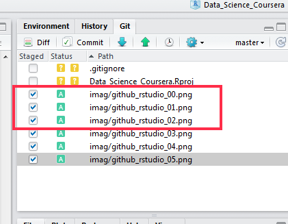

```{r setup, include=FALSE, eval=FALSE}
knitr::opts_chunk$set(echo = TRUE)
```

# Cómo conectar RSTUDIO con GitHub

## Qué es GitHub

Tanto para el curso de especialización en ciencia de datos, como para llevar la documentación de los proyectos de forma ordenada, compartida y con control de versiones, es muy útil usar [GitHub](https://github.com/).

Git es un software de control documental o más especificamente una manera de llevar el control documental y las versiones de los documentos. Se puede usar a nivel particular y privado en un PC, pero donde muestra su verdadera amplitud es cuando se usa de manera compartida entre varios usuarios para el control conjunto de proyectos.

Lo que facilita es que la version de trabajo ultima siempre sea la ultima, e indice una manera de trabajar con la documentación para que esta se mantenga al día y se tenga un historial de cambios, de usuarios que han participado y de los aportes individuales de cada uno al proyecto.

En windows puedes instalar [Git Bash](https://github.com/msysgit/msysgit/releases/), pero lo habitual es usar el servidor en la nube de GitHub, que permite el desarrollo en linea de los proyectos, así como el control de versiones todo en la web.

Lo primero que tienes que hacer para conectar con GitHub es tener una cuenta allí, por lo que si no tienes date de alta y crea un usuario nuevo.


## Conectar con RSTUDIO
Una vez tienes el usuario de GitHub, y quieres conectar con un proyecto almacenado en la nube sigue estos pasos.
Ojo, no es necesario que tengas ningún proyecto propio, siempre puedes clonar uno que ya exista y sobre el que quieras trabajar.


### Paso 1

Activar el control de versiones en RSTUDIO. Si ya lo tenemos activo pasar directamente al paso 2.

Vamos al menú Herramientas (Tools) --> Global Options
Nos sale una nueva ventana con muchas opciones, pulsamos en la parte lateral izquierda donde dice Git/SVN y en las opciones del lado derecho introducimos el directorio donde se encuentra el ejecutable git.exe


### Paso 2

Abre RSTUDIO y pincha en *Archivo* (File) y después en *Nuevo proyecto* (New Project).
En la ventana que nos aparece pinchamos en *Version Control*


### Paso 3

Nos aparecerá otra ventana, y allí seleccionamos Git (clonar un proyecto desde almacen Git)


### Paso 4

Nos vamos a la web de GitHub donde esté el proyecto que queremos clonar, por ejemplo esta web, y copiamos al portapapeles la dirección (url) del proyecto.


Regresamos a RSTUDIO, copiamos la ruta en el apartado correspondiente y debemos introducir también la ruta y directorio final de destino del proyecto en local, por ejemplo en este caso en **C:/R/proyectos**.


### Paso 5

Ya está todo, RSTUDIO bajará una copia de los ficheros desde el almacén de GitHub en la web al directorio de destino local especificado, y sobre el que podremos trabajar en local sin problemas.

## Actualizar cambios

Si en local hacemos cambios y los queremos actualizar ficheros, hay que hacer el proceso de control de versiones de Git.

Primero guardar los cambios e ir a la ventana de Git en RSTUDIO (generalmente situada en la parte derecha arriba)


Para subir un cambio al almacén web (GitHub) debemos hacer un *Commit* es decir proponer qué ficheros se van a actualizar, eso se hace pinchando directamente sobre el nombre del fichero en la ventana de Git.



Como vemos el estado del fichero cambia a *A*, (add) es decir se añaden a la lista de documentos propuestos para el cambio en la linea de tiempos.
Es decir que cuando subamos al almacén los ficheros pasarán a sustituir a los actuales y serán los de la ultima versión.

Pinchamos en el botón *Commit* y se abrirá una nueva ventana para para confirmar los cambios e introducir una descripcion de los mismos:


Para subir definitivamente los ficheros con los cambios debemos hacer un *pull request* pinchando en la flecha hacia arriba de la ventana de Git (control de versiones) en RSTUDIO.


De esta forma los cambios propuestos con el *Commit, se convierten en definitivos y los ficheros se suben a GitHub y aparecen como la version de trabajo actual o master.


